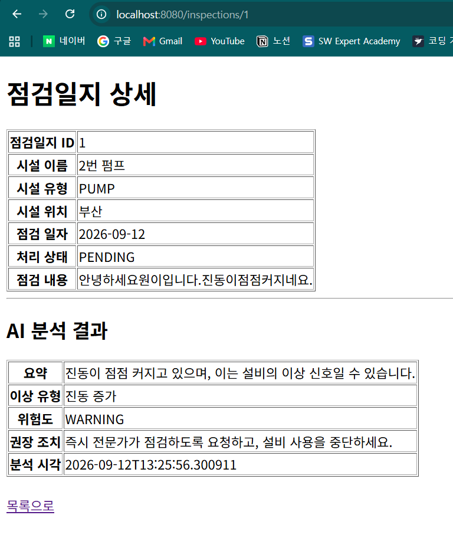

# WaterAPI

## 개발 기록: 시설 등록 및 조회 기능

### 1. 시설 도메인 구현

상하수도 시설을 관리하기 위해 `Facility` 엔티티와 `FacilityType` Enum을 구현했다.

시설이 가지는 정보는 다음과 같다.

- 시설 ID
- 시설 이름
- 시설 유형
- 시설 위치

시설 유형은 문자열이 아닌 Enum으로 제한했다.

```java
public enum FacilityType {
    PUMP,
    VALVE,
    PIPE,
    WATER_QUALITY_SENSOR
}
```

`@Enumerated(EnumType.STRING)`을 적용해 Enum의 순서가 아닌 이름이 DB에 저장되도록 했다.

엔티티에는 `@Data` 대신 `@Getter`를 사용해 불필요한 Setter 생성을 막았다. JPA가 사용할 기본 생성자는 `PROTECTED`로 제한했다.

---

### 2. Repository 구현

```java
public interface FacilityRepository
        extends JpaRepository<Facility, Long> {
}
```

`JpaRepository`의 첫 번째 타입은 관리할 엔티티이고, 두 번째 타입은 엔티티의 `@Id` 타입이다.

- `Facility`: 저장하고 조회할 엔티티
- `Long`: `Facility.id`의 타입

이를 통해 `save()`, `findAll()`, `findById()` 등의 기본 기능을 사용할 수 있다.

---

### 3. Service 구현과 트랜잭션

`FacilityService`가 시설 생성, 저장 및 조회 흐름을 담당하도록 했다.

```text
Controller
→ FacilityService
→ FacilityRepository
→ H2
```

클래스에는 조회 전용 트랜잭션을 적용했다.

```java
@Transactional(readOnly = true)
```

DB를 변경하는 시설 등록 메서드에는 별도로 `@Transactional`을 적용했다.

```java
@Transactional
public Facility registerFacility(
        String name,
        FacilityType facilityType,
        String location
) {
    Facility facility = new Facility(
            name,
            facilityType,
            location
    );

    return facilityRepository.save(facility);
}
```

---

### 4. 시설 등록 Form 검증

브라우저의 입력값을 받기 위해 `FacilityCreateForm`을 만들었다.

- 시설 이름: 빈 값 불가, 최대 50자
- 시설 유형: 선택 필수
- 시설 위치: 빈 값 불가, 최대 100자

Controller에서는 `@Valid`로 입력을 검증하고 `BindingResult`로 실패 여부를 확인한다.

```java
if (bindingResult.hasErrors()) {
    return "facilities/new";
}
```

Form DTO에는 브라우저의 요청값을 바인딩해야 하므로 Getter와 Setter를 사용했다.

---

### 5. 시설 등록 및 목록 조회

구현한 URL은 다음과 같다.

| HTTP Method | URL | 기능 |
|---|---|---|
| GET | `/facilities` | 시설 목록 조회 |
| GET | `/facilities/new` | 시설 등록 화면 |
| POST | `/facilities` | 시설 등록 |

시설이 정상적으로 등록되면 목록 주소로 Redirect한다.

```java
return "redirect:/facilities";
```

Redirect를 사용하면 등록 이후 새로고침했을 때 같은 POST 요청이 다시 전송되는 것을 방지할 수 있다.

---

### 6. URL과 View 이름의 차이

다음 두 값은 서로 다른 역할을 한다.

```java
@GetMapping
public String facilities(Model model) {
    model.addAttribute(
            "facilities",
            facilityService.findFacilities()
    );

    return "facilities/list";
}
```

- `GET /facilities`: 브라우저가 요청하는 URL
- `"facilities/list"`: Controller가 반환하는 View 이름

Thymeleaf는 View 이름을 다음 HTML 파일의 경로로 변환한다.

```text
facilities/list
→ src/main/resources/templates/facilities/list.html
```

따라서 브라우저에서 `/facilities/list`를 직접 요청하면 해당 URL을 처리하는 Controller가 없기 때문에 404가 발생한다.

---

### 7. Thymeleaf 렌더링

Controller는 DB에서 조회한 시설 목록을 Model에 저장한다.

```java
model.addAttribute("facilities", facilities);
```

Thymeleaf는 Model의 데이터와 HTML 템플릿을 결합한다.

```html
<tr th:each="facility : ${facilities}">
    <td th:text="${facility.id}"></td>
    <td th:text="${facility.name}"></td>
    <td th:text="${facility.facilityType}"></td>
    <td th:text="${facility.location}"></td>
</tr>
```

시설이 두 개라면 `th:each`가 두 번 반복되어 두 개의 `<tr>`이 생성된다.

최종적으로 브라우저에 전달되는 HTML은 다음과 같은 형태가 된다.

```html
<tr>
    <td>1</td>
    <td>2번 펌프</td>
    <td>PUMP</td>
    <td>청주 정수장</td>
</tr>

<tr>
    <td>2</td>
    <td>3번 배관</td>
    <td>PIPE</td>
    <td>청주 배수지</td>
</tr>
```

`list.html` 파일에 데이터가 직접 추가되는 것은 아니다. 요청이 들어올 때마다 Thymeleaf가 최신 데이터로 최종 HTML을 만들어 브라우저에 전달한다.

---

### 8. 전체 요청 흐름

```text
시설 등록 화면
→ POST /facilities
→ FacilityCreateForm에 요청값 바인딩
→ @Valid 입력 검증
→ FacilityService
→ FacilityRepository
→ H2 저장
→ redirect:/facilities
→ GET /facilities
→ 최신 시설 목록 조회
→ Thymeleaf 렌더링
```

---

### 9. 테스트

다음 내용을 테스트했다.

- Facility 엔티티 저장
- FacilityService를 통한 시설 등록
- 존재하지 않는 시설 조회 예외
- 시설 목록 화면 반환
- 시설 등록 화면 반환
- 정상 등록 시 Service 호출 및 Redirect
- 잘못된 입력이면 Service를 호출하지 않는지 검증

Controller 테스트에서는 `MockMvc`를 사용해 실제 서버를 실행하지 않고 HTTP 요청 처리를 확인했다.

```text
가짜 HTTP 요청
→ Controller 실행
→ HTTP 상태 코드 검증
→ Model 검증
→ View 이름 검증
→ Redirect 및 Service 호출 검증
```

다음 테스트는 `/facilities` 요청이 정상 처리되고 목록 화면을 반환하는지 검증한다.

```java
mockMvc.perform(get("/facilities"))
        .andExpect(status().isOk())
        .andExpect(view().name("facilities/list"))
        .andExpect(model().attributeExists("facilities"));
```

- `get("/facilities")`: Controller에 GET 요청
- `status().isOk()`: HTTP 200 응답 검증
- `view().name("facilities/list")`: 목록 View 반환 검증
- `attributeExists("facilities")`: Model에 시설 목록이 있는지 검증

---


## AI 분석 기본 구조 설계

점검 내용을 생성형 AI에 전달하고, 분석 결과를 애플리케이션에서 일정한 형식으로 사용하기 위한 기본 구조를 구현했다.

### 1. RiskLevel

AI가 판단한 점검 결과의 위험도를 Enum으로 제한했다.

```java
public enum RiskLevel {
    NORMAL,
    CAUTION,
    WARNING
}
```

- `NORMAL`: 특이사항이 없는 정상 상태
- `CAUTION`: 추가 확인이 필요한 주의 상태
- `WARNING`: 빠른 점검이나 조치가 필요한 위험 상태

문자열을 직접 사용하는 대신 Enum으로 관리해 잘못된 위험도 값이 사용되는 것을 방지한다.

---

### 2. InspectionAnalysisResponse

AI가 반환한 분석 결과를 애플리케이션 내부에서 사용할 DTO로 구현했다.

```java
public class InspectionAnalysisResponse {

    private String summary;
    private String abnormalityType;
    private RiskLevel riskLevel;
    private String recommendedAction;
}
```

각 필드의 역할은 다음과 같다.

| 필드 | 역할 |
|---|---|
| `summary` | 점검 내용의 핵심 요약 |
| `abnormalityType` | 발견된 이상 유형 |
| `riskLevel` | 정상·주의·위험 단계 |
| `recommendedAction` | 담당자에게 제안할 점검 및 조치 내용 |

외부 AI의 응답을 그대로 사용하지 않고 내부 DTO로 변환하면 Controller와 Service가 AI 응답 형식에 직접 의존하지 않게 된다.

`@NoArgsConstructor`는 이후 JSON 응답을 객체로 변환할 때 사용할 수 있고, `@AllArgsConstructor`는 테스트나 객체 생성 시 모든 값을 한 번에 전달할 수 있게 한다.

---

### 3. InspectionAiClient

외부 AI 호출 역할을 담당하는 인터페이스를 구현했다.

```java
public interface InspectionAiClient {

    InspectionAnalysisResponse analyze(String inspectionContent);
}
```

입력으로 점검 내용을 받고, 분석 결과인 `InspectionAnalysisResponse`를 반환한다.

Service가 OpenAI API를 직접 호출하지 않고 `InspectionAiClient` 인터페이스에 의존하도록 설계했다.

```text
InspectionService
→ InspectionAiClient
→ 외부 AI API
```

이렇게 분리하면 다음과 같은 장점이 있다.

- 외부 AI 호출 코드와 업무 처리 코드를 분리할 수 있다.
- AI API가 변경되어도 Service의 변경을 줄일 수 있다.
- 테스트에서 실제 AI API 대신 Mock 객체를 사용할 수 있다.
- API 호출 없이 분석 및 저장 흐름을 테스트할 수 있다.

현재는 호출 규칙을 나타내는 인터페이스만 만들었으며, 실제 OpenAI API 구현체는 이후 단계에서 추가한다.

# RESTCLIENT

- RestClient는 Spring에서 외부 HTTP API를 호출할 때 사용하는 객체.
- CloudGuard에서 AWS SDK Client를 @Bean으로 등록한거랑 비슷

<실행 테스트 명령어>
SPRING_PROFILES_ACTIVE=openai ./gradlew.bat bootRun

