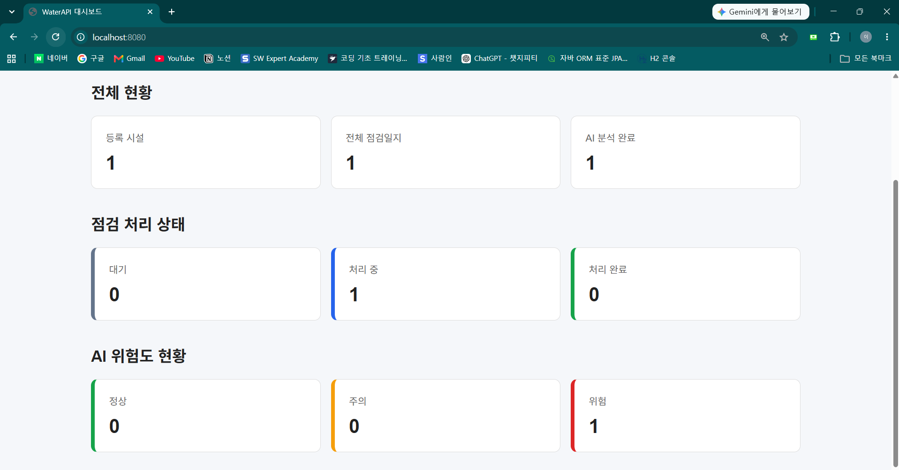
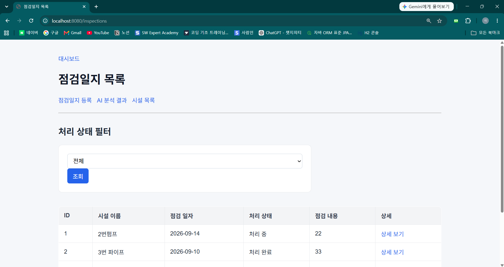
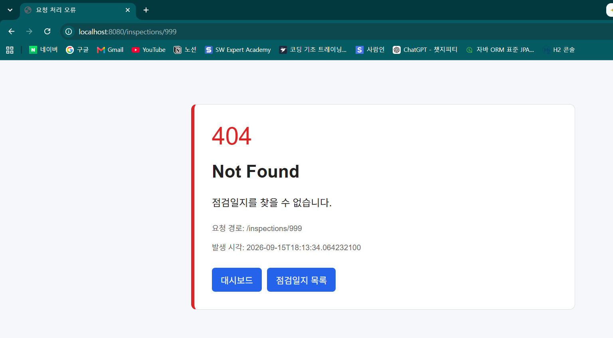
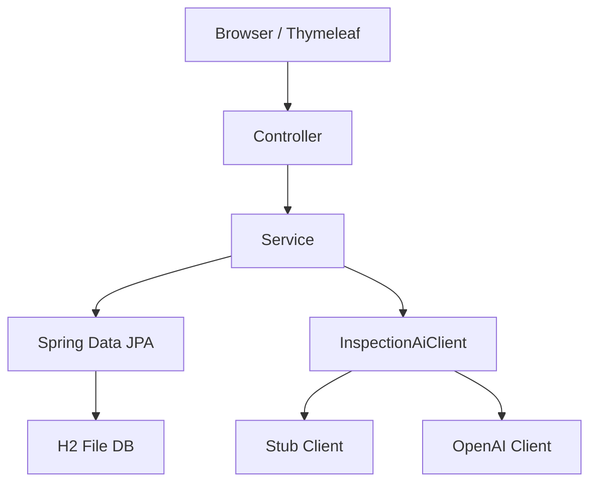
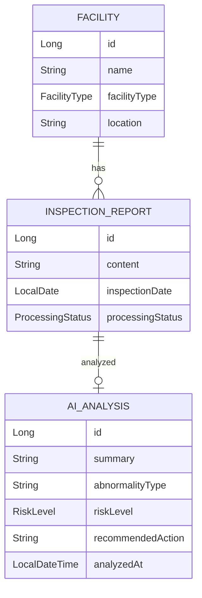
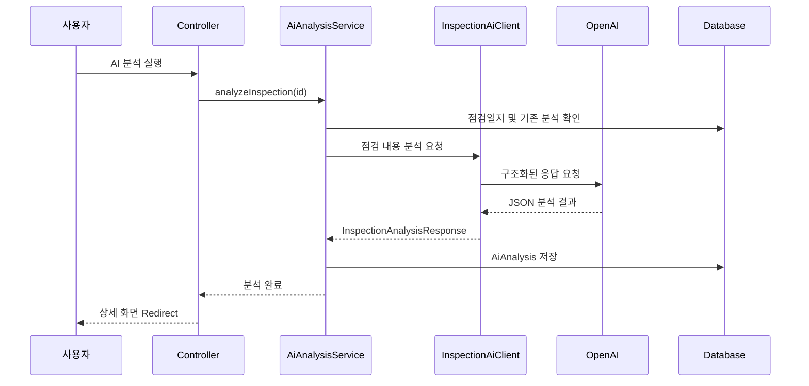
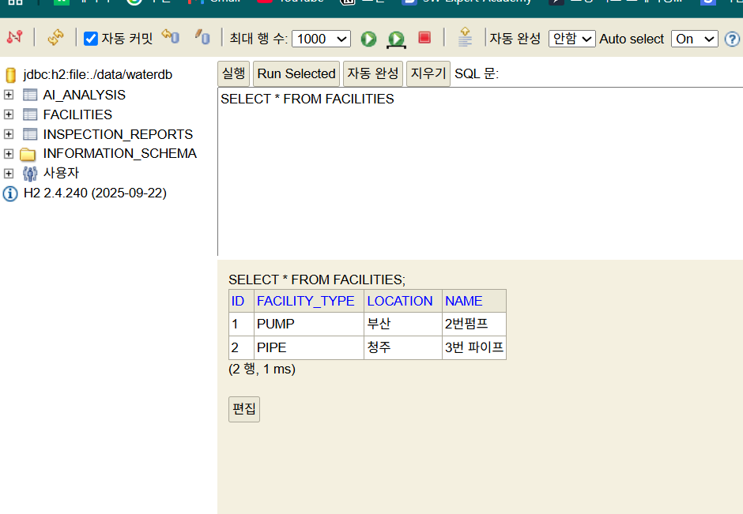

# WaterAPI

상하수도 시설과 점검일지를 관리하고, 점검 내용을 OpenAI로 분석해 이상 유형, 위험도, 권장 조치를 제공하는 웹 애플리케이션입니다.

단순한 AI 호출에 그치지 않고 시설과 점검일지의 생명주기, 분석 결과의 정합성, 처리 상태 관리, 예외 처리와 데이터 영속성까지 하나의 업무 흐름으로 구현했습니다.

> 개인 프로젝트 · Java/Spring Boot 기반  
> AI 분석 결과는 시설 관리자의 판단을 보조하기 위한 참고 정보입니다.



---

## 주요 기능

### 시설 관리

- 상하수도 시설 등록·조회·수정·삭제
- 시설 유형을 `Enum`으로 제한
- Bean Validation을 이용한 입력값 검증
- 점검일지가 연결된 시설의 삭제 차단
- 사용 중인 시설 삭제 요청에 `409 Conflict` 반환

### 점검일지 관리

- 시설별 점검일지 등록·조회·수정·삭제
- 처리 상태 관리
    - `PENDING`: 대기
    - `IN_PROGRESS`: 처리 중
    - `COMPLETED`: 처리 완료
- 처리 상태 필터
- 최신 점검일 기준 정렬
- 페이지네이션
- 점검일지 수정 시 기존 AI 분석 결과 삭제 후 재분석 지원

### AI 점검 분석

- OpenAI Responses API 연동
- 점검 내용으로부터 다음 결과 생성
    - 핵심 요약
    - 이상 유형
    - 위험도
    - 권장 조치
- JSON Schema 기반 구조화된 응답
- 위험도를 `NORMAL`, `CAUTION`, `WARNING`으로 제한
- 점검일지와 분석 결과를 `1:1` 관계로 관리
- 이미 분석된 점검일지의 중복 분석 차단
- 위험도 필터 및 페이지네이션



### 통합 대시보드

- 전체 시설 수
- 전체 점검일지 수
- AI 분석 완료 수
- 처리 상태별 점검일지 수
- 위험도별 AI 분석 결과 수

### 공통 예외 처리

- `404 Not Found`: 존재하지 않는 시설 또는 점검일지
- `409 Conflict`: 중복 AI 분석 또는 사용 중인 시설 삭제
- `502 Bad Gateway`: OpenAI 호출 또는 응답 처리 실패
- `400 Bad Request`: 잘못된 요청
- `@ControllerAdvice`를 이용한 공통 오류 화면 제공



---

## 기술 스택

| 구분 | 기술 |
|---|---|
| Language | Java 17 |
| Framework | Spring Boot 4.1.1, Spring MVC |
| View | Thymeleaf, HTML, CSS |
| Data | Spring Data JPA, Hibernate, H2 |
| Validation | Jakarta Bean Validation |
| AI | OpenAI Responses API, Spring RestClient |
| Test | JUnit 5, AssertJ, MockMvc |
| Build | Gradle |
| 기타 | Lombok |

---

## 애플리케이션 구조



계층별 역할을 다음과 같이 분리했습니다.

```text
Controller
- HTTP 요청과 Form 데이터 처리
- 입력 검증 결과 확인
- View와 Redirect 결정

Service
- 시설·점검·AI 분석 업무 규칙 처리
- 트랜잭션 경계 설정
- 엔티티 변경과 삭제 정책 처리

Repository
- JPA를 이용한 저장과 조회
- 상태·위험도 필터 및 집계

InspectionAiClient
- AI 분석 호출 규격 정의
- Stub과 OpenAI 구현체 교체
```

---

## 도메인 관계



- 하나의 시설은 여러 점검일지를 가질 수 있습니다.
- 하나의 점검일지는 최대 하나의 AI 분석 결과만 가질 수 있습니다.
- AI 분석 테이블의 점검일지 외래 키에 유일성 제약을 적용했습니다.

---

## AI 분석 처리 흐름



OpenAI가 반환한 JSON을 애플리케이션 내부 DTO인 `InspectionAnalysisResponse`로 변환한 후 엔티티로 저장합니다.

Service는 구체적인 OpenAI 구현체가 아니라 `InspectionAiClient` 인터페이스에 의존합니다.

```java
public interface InspectionAiClient {

    InspectionAnalysisResponse analyze(
            String inspectionContent
    );
}
```

이를 통해 실제 API를 호출하지 않는 Stub 구현체와 실제 OpenAI 구현체를 실행 환경에 따라 교체할 수 있습니다.

---

## 실행 프로필

### Stub 프로필

기본 실행에서는 OpenAI API를 호출하지 않는 Stub 구현체를 사용합니다.

```bash
./gradlew.bat bootRun
```

```text
StubInspectionAiClient
→ 고정된 분석 결과 반환
→ API 키와 호출 비용 없이 기능 확인
```

### OpenAI 프로필

Git Bash에서 API 키를 환경변수로 입력합니다.

```bash
read -s OPENAI_API_KEY
export OPENAI_API_KEY
```

OpenAI 프로필로 실행합니다.

```bash
./gradlew.bat bootRun \
  --args="--spring.profiles.active=openai"
```

API 키는 코드나 설정 파일에 직접 저장하지 않습니다.

```properties
openai.api-key=${OPENAI_API_KEY:}
```

---

## 핵심 설계 결정

### 1. AI Client 인터페이스 분리

`AiAnalysisService`가 `OpenAiInspectionClient`에 직접 의존하면 외부 API 변경이나 테스트 과정에서 Service도 영향을 받습니다.

이를 줄이기 위해 호출 규격을 `InspectionAiClient` 인터페이스로 분리했습니다.

```text
AiAnalysisService
→ InspectionAiClient
   ├─ StubInspectionAiClient
   └─ OpenAiInspectionClient
```

결과적으로 다음이 가능해졌습니다.

- 실제 OpenAI API와 Stub 구현체 교체
- API 키 없이 로컬 기능 확인
- Service와 외부 API 호출 코드의 책임 분리
- 테스트에서 AI 호출 대체

### 2. 구조화된 AI 응답

자연어 응답을 문자열 파싱으로 처리하면 출력 형식이 달라질 때 오류가 발생할 수 있습니다.

OpenAI 요청에 JSON Schema를 지정해 다음 필드를 필수로 반환하도록 제한했습니다.

```json
{
  "summary": "점검 내용 요약",
  "abnormalityType": "이상 유형",
  "riskLevel": "NORMAL | CAUTION | WARNING",
  "recommendedAction": "권장 조치"
}
```

외부 응답을 내부 DTO로 변환해 Controller와 Service가 OpenAI 응답 구조에 직접 의존하지 않도록 했습니다.

### 3. 점검일지와 분석 결과의 정합성

점검 내용을 수정해도 기존 분석 결과가 남아 있으면 수정 전 내용을 기준으로 한 잘못된 결과가 노출됩니다.

따라서 점검일지 수정 트랜잭션에서 기존 분석 결과를 함께 삭제합니다.

```text
점검일지 수정
→ 기존 AI 분석 삭제
→ 미분석 상태로 전환
→ 수정된 내용으로 재분석
```

### 4. 연관 데이터가 있는 시설의 삭제 차단

점검일지가 연결된 시설을 삭제하면 참조 무결성 문제가 발생할 수 있습니다.

삭제 전에 연결된 점검일지 존재 여부를 확인하고, 사용 중인 시설이면 `FacilityInUseException`을 발생시켜 삭제를 차단했습니다.

```text
시설 삭제 요청
→ 연결된 점검일지 확인
→ 존재하면 409 Conflict
→ 존재하지 않으면 삭제
```

### 5. 실행 DB와 테스트 DB 분리

로컬 실행에서는 H2 파일 DB를 사용해 서버를 재시작해도 데이터를 유지합니다.

```properties
spring.datasource.url=jdbc:h2:file:./data/waterdb
spring.jpa.hibernate.ddl-auto=update
```

테스트에서는 별도의 H2 인메모리 DB를 사용합니다.

```properties
spring.datasource.url=jdbc:h2:mem:waterdb-test
spring.jpa.hibernate.ddl-auto=create-drop
```

따라서 테스트 데이터가 로컬 실행 데이터에 영향을 주지 않습니다.



---

## 문제 해결 경험

### `InspectionAiClient` Bean을 찾지 못한 문제

`AiAnalysisService`는 `InspectionAiClient`를 주입받지만 활성화된 구현체가 없어 애플리케이션 시작이 실패했습니다.

```text
NoSuchBeanDefinitionException:
InspectionAiClient Bean을 찾을 수 없음
```

Stub과 OpenAI 구현체에 실행 프로필을 적용해 활성 프로필에 맞는 Bean이 등록되도록 해결했습니다.

```java
@Profile("stub")
public class StubInspectionAiClient
        implements InspectionAiClient {
}
```

```java
@Profile("openai")
public class OpenAiInspectionClient
        implements InspectionAiClient {
}
```

### 목록과 페이지 객체의 타입 불일치

AI 분석 목록 화면은 `Page`의 `content`, `totalPages`를 사용했지만 Controller가 `List`를 전달해 Thymeleaf 평가 오류가 발생했습니다.

```text
Controller 전달: List<AiAnalysis>
View 기대:      Page<AiAnalysis>
```

Controller와 Service의 반환 타입을 `Page<AiAnalysis>`로 통일하고 `Pageable`을 전달하도록 수정했습니다.

### H2 메모리 DB의 데이터 소실

초기에는 `jdbc:h2:mem`을 사용해 서버를 재시작할 때 시설과 점검 데이터가 모두 사라졌습니다.

로컬 실행 DB를 H2 파일 방식으로 변경하고 `ddl-auto=update`를 적용해 재시작 후에도 데이터를 유지하도록 개선했습니다.

### 예외 메시지가 사용자 화면에 표시되지 않은 문제

404 화면은 렌더링됐지만 상태 코드와 메시지가 표시되지 않았습니다.

전역 예외 처리 메서드에서 오류 정보를 Model에 전달하지 않은 것이 원인이었습니다.

```java
addErrorAttributes(
        model,
        request,
        HttpStatus.NOT_FOUND,
        exception.getMessage()
);
```

상태 코드, 오류 이름, 메시지, 요청 경로, 발생 시각을 공통으로 Model에 저장하도록 수정했습니다.

---

## 주요 URL

| Method | URL | 기능 |
|---|---|---|
| GET | `/` | 대시보드 |
| GET | `/facilities` | 시설 목록 |
| GET | `/facilities/new` | 시설 등록 화면 |
| POST | `/facilities` | 시설 등록 |
| GET | `/facilities/{id}/edit` | 시설 수정 화면 |
| POST | `/facilities/{id}/edit` | 시설 수정 |
| POST | `/facilities/{id}/delete` | 시설 삭제 |
| GET | `/inspections` | 점검일지 목록 |
| GET | `/inspections/new` | 점검일지 등록 화면 |
| POST | `/inspections` | 점검일지 등록 |
| GET | `/inspections/{id}` | 점검일지 상세 |
| GET | `/inspections/{id}/edit` | 점검일지 수정 화면 |
| POST | `/inspections/{id}/edit` | 점검일지 수정 |
| POST | `/inspections/{id}/delete` | 점검일지 삭제 |
| POST | `/inspections/{id}/status` | 처리 상태 변경 |
| POST | `/inspections/{id}/analysis` | AI 분석 실행 |
| GET | `/analyses` | AI 분석 결과 목록 |

---

## 테스트 전략

모든 구현 세부사항을 테스트하기보다 핵심 업무 규칙과 요청 흐름을 중심으로 검증했습니다.

### Repository

- 시설 및 점검일지 저장·조회
- JPA 연관관계 저장
- 위험도와 처리 상태 조회

### Service

- 존재하지 않는 시설과 점검일지 예외
- 점검일지 처리 상태 변경
- 이미 분석된 점검일지의 중복 분석 차단
- 점검일지 수정과 변경 감지

### Controller

- 시설 및 점검일지 등록 화면
- 정상 등록 후 Redirect
- 잘못된 입력의 Field Error
- 분석 결과 목록과 위험도 필터
- 페이지 객체의 Model 전달

테스트 실행:

```bash
./gradlew.bat test
```

테스트는 `src/test/resources/application.properties`의 별도 인메모리 DB를 사용합니다.

---

## 로컬 실행

### 요구사항

- Java 17
- Windows 또는 Gradle 실행 환경
- 실제 AI 분석 시 OpenAI API Key

### 저장소 실행

```bash
git clone https://github.com/kjune922/WaterAPI.git
cd WaterAPI
./gradlew.bat bootRun
```

브라우저 접속:

```text
http://localhost:8080
```

H2 Console:

```text
http://localhost:8080/h2-console
```

H2 접속 정보:

```text
JDBC URL: jdbc:h2:file:./data/waterdb
User Name: sa
Password:
```

---

## 프로젝트 구조

```text
src/main/java/com/kjune922/waterapi
├── analysis       # AI 분석 엔티티·서비스·목록
├── client         # Stub/OpenAI AI Client
├── config         # OpenAI RestClient 설정
├── controller     # 시설 MVC Controller
├── dashboard      # 현황 집계
├── domain         # 위험도 Enum
├── dto            # AI 응답 DTO
├── exception      # 커스텀 예외와 공통 처리
├── facility       # 시설 도메인
├── form           # 시설 Form DTO
└── inspection     # 점검일지 도메인
```

---

## 한계 및 개선 방향

- 현재 로컬 저장소는 H2 파일 DB를 사용하므로 운영 환경에서는 MySQL 등의 외부 DB로 분리할 필요가 있습니다.
- OpenAI 분석은 동기 방식이므로 요청 시간이 길어질 수 있습니다.
- 외부 API 장애에 대한 재시도와 타임아웃 정책을 보완할 필요가 있습니다.
- 사용자 인증과 시설 관리자별 권한 구분이 구현되어 있지 않습니다.
- 운영 환경에서는 API 키를 AWS Systems Manager Parameter Store 등의 보안 저장소로 관리할 수 있습니다.
- 향후 Docker 기반 실행 환경과 CI/CD를 추가할 수 있습니다.

---

## 개발자

- GitHub: [kjune922](https://github.com/kjune922)